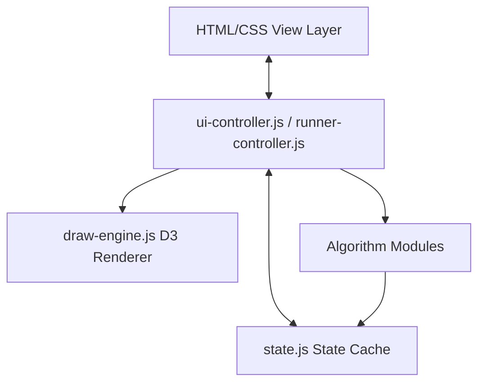

# Automata Toolkit

A comprehensive, enterprise-grade, client-side interactive web application for building, simulating, analyzing, and converting Finite Automata (Epsilon-NFA, NFA, DFA) and Regular Expressions.

This project is built using vanilla JavaScript (ES6 Modules) and D3.js for physics-based force graph rendering. It operates completely client-side without any backend database or server processing, ensuring total data privacy.

---

## Getting Started

This application consists of static frontend assets. Because it uses standard ES6 modules (`import`/`export`), it **must be served via a local web server** to satisfy the browser's Same-Origin policy.

Ensure you are in the project root directory (containing [index.html](./index.html)) before running any server commands.

### Option A: Python Web Server (Recommended)
If you have Python installed, launch a simple HTTP server instantly:
```bash
python -m http.server 8000
```
Then open [http://localhost:8000](http://localhost:8000) in your browser.

### Option B: Node.js / NPX Server
If you have Node.js installed, serve the directory using `serve`:
```bash
npx serve .
```
Then navigate to the localhost URL shown in the terminal.

### Option C: VS Code Live Server
1. Open the project folder in VS Code.
2. Install the **Live Server** extension (by Ritwick Dey).
3. Right-click [index.html](./index.html) and select **Open with Live Server**.

---

## Architectural Design & Coding Patterns

The codebase adheres to a strict Model-View-Controller (MVC) design pattern using modern ES6 modules. 



### Core Architecture & State Management
- **State Store ([state.js](./state.js)):** Operates as the centralized, single source of truth for the currently active automaton (`automata`) and its cached conversion histories (`enfa`, `nfa`, `dfa`, `minimizedDfa`, `complementedDfa`). All state mutations are performed via deep cloning (`JSON.parse(JSON.stringify(obj))`) to enforce data immutability and prevent memory leaks.
- **Controller Layer ([ui-controller.js](./ui-controller.js)):** Coordinates view updates, parses user forms, attaches event listeners to dynamic table actions, and handles transition table rebuilding.
- **Time-Travel Simulation Engine ([runner-controller.js](./runner-controller.js)):** Implements history tracking by recording active states and edges traversed step-by-step. This enables stepping forward and backward through the input word.
- **Security & Privacy:** The toolkit executes entirely in the user's browser context. It does not send telemetry, analytics, or model configurations to remote servers, conforming to enterprise data sovereignty requirements.

### CSS Design Tokens & Theming ([styles.css](./styles.css))
The interface uses a design system powered by CSS custom properties (variables) for consistent UI branding and theming:
- `--primary-color` (`#007bff`): Standard branding and navigation color.
- `--primary-hover` (`#0056b3`): State highlights for button hovers.
- `--active-color` (`#f39c12`): Edge and state highlight color during playhead simulation.
- `--active-bg` (`#ffeb3b`): Background highlight for currently active simulator nodes.

---

## Module Overview

| File Path | Description |
| :--- | :--- |
| [state.js](./state.js) | Centralized, immutable application state store managing all active automata versions. |
| [automata-library.js](./automata-library.js) | Main bootstrap script. Handles input normalization and exposes modules to the global scope. |
| [ui-controller.js](./ui-controller.js) | View coordinator managing transitions, layout swapping, and routing conversion actions. |
| [runner-controller.js](./runner-controller.js) | Time-travel tape simulation engine tracking execution history. |
| [dom-manipulator.js](./dom-manipulator.js) | DOM view bindings that read and construct the interactive HTML input tables. |
| [draw-engine.js](./draw-engine.js) | High-performance D3.js physics engine rendering state graphs and active execution paths. |
| [import-export.js](./import-export.js) | File deserializer and image exporter mapping data to vector SVG or high-res PNG formats. |
| [automata-logic.js](./automata-logic.js) | Low-level automata graph traversals and mathematical Epsilon closures. |
| [converter-logic.js](./converter-logic.js) | Formal powerset subset construction compiling NFAs to DFAs. |
| [minimize-logic.js](./minimize-logic.js) | State reduction engine implementing Hopcroft's partition refinement algorithm. |
| [complementDfa.js](./complementDfa.js) | Complementation module inverting accepting criteria on completed transition mappings. |
| [equivalence-logic.js](./equivalence-logic.js) | Cartesian product isomorphism testing and BFS string counter-example generator. |
| [equivalence-ui.js](./equivalence-ui.js) | Equivalence panel handlers binding file imports and comparing side-by-side graphs. |
| [regex-parser.js](./regex-parser.js) | Dijkstra's Shunting-yard compiler converting infix expressions to postfix format. |
| [regex-to-enfa.js](./regex-to-enfa.js) | Thompson's Construction compilation converting regular expressions into Epsilon NFAs. |
| [automata-to-regex.js](./automata-to-regex.js) | Generalized NFA (GNFA) State Elimination algorithm converting automata to simplified regex. |
| [automata-utils.js](./automata-utils.js) | Helper utilities for completing transition functions and re-indexing compound state labels. |
| [regex-utils.js](./regex-utils.js) | Algebraic simplifiers optimizing union, concatenation, and Kleene star operators. |
| [index.html](./index.html) | Foundational DOM structure layout for the visualizer panels. |
| [styles.css](./styles.css) | Custom styling, glassmorphism components, and simulation micro-animations. |
| [help.html](./help.html) | Embedded developer manual detailing operations, examples, and syntax. |

---

## Detailed Algorithm Walkthrough

### 1. Infix to Postfix Parser
* **Module:** [regex-parser.js](./regex-parser.js)
* **Algorithm:** Dijkstra's Shunting-Yard Algorithm.
* **Process:** Standard regex implicitly concatenates symbols (e.g., `ab` is `a` concatenated with `b`). The compiler inserts an explicit, non-printable concatenation marker (`\x08`) by scanning the string and checking character lookaheads. It then parses the infix tokens into a postfix list based on operator precedence:
  $$\text{Kleene Star (*)} \quad > \quad \text{Concatenation (\x08)} \quad > \quad \text{Union (|)}$$

### 2. Regex to Epsilon-NFA ($\epsilon$-NFA) Conversion
* **Module:** [regex-to-enfa.js](./regex-to-enfa.js)
* **Algorithm:** Thompson's Construction.
* **Process:** Processes the postfix regular expression token-by-token using an evaluation stack:
  - **Operands:** Create a base sub-automaton consisting of a start state, an accept state, and a single transition on the character.
  - **Concatenation ($A \cdot B$):** Bridges the accept state of $A$ to the start state of $B$ via an $\epsilon$-transition (represented as `#`).
  - **Union ($A \mid B$):** Generates a new start state branching via $\epsilon$-transitions to the start of $A$ and $B$, and a new accept state that both $A$ and $B$'s accept states link to.
  - **Kleene Star ($A^*$):** Generates a new start state and accept state, adding an $\epsilon$-transition from the accept state of $A$ back to its start state, and a bypass $\epsilon$-transition from the new start state directly to the new accept state.

### 3. Epsilon Transition Elimination
* **Module:** [automata-logic.js](./automata-logic.js)
* **Algorithm:** $\epsilon$-Closure Traversal.
* **Process:** Computes the mathematical $\epsilon$-closure (reachable states using only `#` transitions) for every state using Breadth-First Search (BFS). It then constructs an equivalent standard NFA:
  - The new transition function computes $\delta'(q, a) = \epsilon\text{-closure}(\delta(\epsilon\text{-closure}(q), a))$ for each alphabet character $a$.
  - A state becomes accepting in the new NFA if its $\epsilon$-closure contains an accepting state from the original $\epsilon$-NFA.

### 4. Subset Construction (NFA to DFA)
* **Module:** [converter-logic.js](./converter-logic.js)
* **Algorithm:** Powerset Construction.
* **Process:** Explores the reachable subset states of the NFA starting from the $\epsilon$-closure of the NFA start state:
  1. The subset of NFA states is formatted into a deterministic name string (e.g. `q0-q1`).
  2. For each state subset and alphabet character, it computes the set of reachable states and takes their $\epsilon$-closure.
  3. If a newly generated state subset hasn't been visited, it is added to a BFS queue.
  4. Any DFA state whose represented NFA subset contains at least one NFA accept state is marked as accepting.

### 5. DFA Minimization
* **Module:** [minimize-logic.js](./minimize-logic.js)
* **Algorithm:** Hopcroft's Partition Refinement.
* **Process:**
  1. **Completion:** Prepares the DFA by completing its transition function (mapping missing transitions to a `deadState`).
  2. **Reachability:** Prunes mathematically unreachable states using a Depth-First Search (DFS) from the start state.
  3. **Partitioning:** Separates states into two initial equivalence partitions: accepting states ($F$) and non-accepting states ($Q \setminus F$).
  4. **Refinement:** Iteratively splits partitions if their elements transition to different partitions on the same input symbol. This continues until no partitions are split.
  5. **Reconstruction:** Fuses states within the same partition group, formatting compound names and mapping transitions to the representative groups.

### 6. DFA Complementation
* **Module:** [complementDfa.js](./complementDfa.js)
* **Algorithm:** State Accept Inversion.
* **Process:** Completes the DFA's transition function (ensuring it is a total function) by injecting a self-looping `deadState` sink for any undefined state-symbol pair. Once completed, it mathematically inverts the accept status of all states:
  $$F' = Q \setminus F$$

### 7. Language Equivalence & Isomorphism
* **Module:** [equivalence-logic.js](./equivalence-logic.js)
* **Algorithm:** BFS Cartesian Product Traversal.
* **Process:**
  1. Standardizes both input automata by converting them to Minimized DFAs and renaming states to normalized labels (`q0, q1...`).
  2. Traverses the Cartesian product space $Q_A \times Q_B$ starting at $(start_A, start_B)$ using BFS.
  3. If at any reachable state pair $(q_A, q_B)$, one state accepts while the other rejects ($q_A \in F_A \oplus q_B \in F_B$), the languages are not equivalent, and the BFS path is returned as the shortest counterexample string.
  4. If the traversal completes without identifying a mismatch, the isomorphism mapping ($q_A \mapsto q_B$) is generated, proving language equivalence.

### 8. GNFA State Elimination (Automaton to Regex)
* **Module:** [automata-to-regex.js](./automata-to-regex.js)
* **Algorithm:** Generalized NFA State Elimination.
* **Process:**
  1. Converts the input automaton into a Minimal DFA to prevent combinatorial explosion.
  2. Wraps the DFA into a GNFA by introducing a dedicated start state `GNFA_START` (with an $\epsilon$-transition to the original start state) and a dedicated accept state `GNFA_ACCEPT` (with $\epsilon$-transitions from all original accept states).
  3. Eliminates internal states one by one. For each state $q$ removed, it updates the transitions between all remaining pairs $(p, r)$ using the regular expression formula:
     $$R_{pr} \leftarrow R_{pr} \mid (R_{pq} \cdot (R_{qq})^* \cdot R_{qr})$$
  4. The final remaining transition from `GNFA_START` to `GNFA_ACCEPT` represents the equivalent Regular Expression.

### 9. Complement Regular Expression Macro Pipeline
* **Module:** Linked across [ui-controller.js](./ui-controller.js) and [automata-to-regex.js](./automata-to-regex.js)
* **Process:** Implements a multi-stage compilation pipeline to complement a language directly from a Regular Expression string:
  $$\text{Regex} \xrightarrow{\text{Thompson}} \epsilon\text{-NFA} \xrightarrow{\text{Epsilon-Removal}} \text{NFA} \xrightarrow{\text{Subset Construction}} \text{DFA} \xrightarrow{\text{Minimization}} \text{Min DFA} \xrightarrow{\text{Accept Inversion}} \text{Complement DFA} \xrightarrow{\text{GNFA State Elimination}} \text{Inverted Regex}$$

---

## Interactive Visualization Engine

Graph rendering is managed by the high-performance physics-based visualizer in [draw-engine.js](./draw-engine.js):
- **Force-Directed Graph:** Leverages `d3.forceSimulation` applying three primary physical forces:
  - `forceLink` (target separation distance of 200px)
  - `forceManyBody` (repelling node strength of -500)
  - `forceCenter` (pulling the graph centroid to the center of the viewport)
- **Path Geometry Calculations:** Recalculates geometries dynamically on every physics `tick`:
  - **Self-Loops:** Renders a circular arc above the node (`A` SVG path command) to prevent overlapping state circles.
  - **Bidirectional Edges:** Curves paths (`A` command path using the distance $dr$ as the radius) in opposite directions to prevent overlapping straight paths from obscuring directional labels.
  - **Straight Edges:** Renders standard lines (`L` path command) for simple state links.
- **Dynamic ViewBox Scaling:** Recalculates graph boundaries during active node drag events. If a state node is moved beyond the viewport margins, the SVG canvas expands its `viewBox` dynamically, ensuring no graph components are clipped.

---

## Data Model Specifications

All logical modules consume and produce objects conforming to the JSDoc `Automaton` schema defined in [state.js](./state.js):

```javascript
/**
 * @typedef {Object} Automaton
 * @property {string} type - The type of the automaton ('ENFA', 'NFA', or 'DFA').
 * @property {string[]} states - Array of state names (e.g., ['q0', 'q1', 'q2']).
 * @property {string[]} alphabet - Array of input symbols (e.g., ['0', '1']).
 * @property {string} start - The initial state (e.g., 'q0').
 * @property {string[]} accept - Array of accepting/final state names (e.g., ['q2']).
 * @property {Object.<string, Object.<string, string[]|string>>} transitions - The transition mapping.
 *           Format for NFA/eNFA: { q0: { '0': ['q0', 'q1'], '1': ['q0'] } }
 *           Format for DFA: { q0: { '0': ['q1'], '1': ['q0'] } }
 */
```

---

## File Exchange Serialization

The application features custom `.txt` serialization to import and export configurations.

### Custom Plain-Text Schema (.txt)
The structure utilizes specific line-by-line headers followed by a list of space-delimited transitions:

```text
TYPE: DFA
STATES: q0, q1, q2
ALPHABET: 0, 1
START: q0
ACCEPT: q2
TRANSITIONS:
q0 0 q0
q0 1 q1
q1 0 q2
q1 1 q0
q2 0 q1
q2 1 q2
```

- **Imports:** The parser in [import-export.js](./import-export.js) parses files matching this schema. If the uploaded content is not a valid text-serialized automaton, it falls back to parsing the contents as a raw regular expression string, converting it into an equivalent Epsilon-NFA.
- **Exports:** Serializes the active automaton model to text for download. The D3 graphics can also be exported to standalone vector `.svg` or high-resolution `.png` files with stylesheet properties injected for external viewing.

---

## Troubleshooting

- **Regex parsing throws "Mismatched parentheses":** Ensure that every opening parenthesis `(` has a corresponding closing parenthesis `)`. Do not use explicit dot `.` characters for concatenation, as it is resolved implicitly. Epsilon transitions should be designated by the `#` symbol.
- **Import fails with "Invalid Automaton TYPE":** Ensure the header specifies `TYPE: DFA`, `TYPE: NFA`, or `TYPE: ENFA` in uppercase, and that all fields are separated by colon (`:`) markers.
- **ES6 modules fail to load in browser:** Direct execution by double-clicking [index.html](./index.html) will block modules. Launch a local web server (Python or Node.js) as outlined in the **Getting Started** section to resolve local imports.
